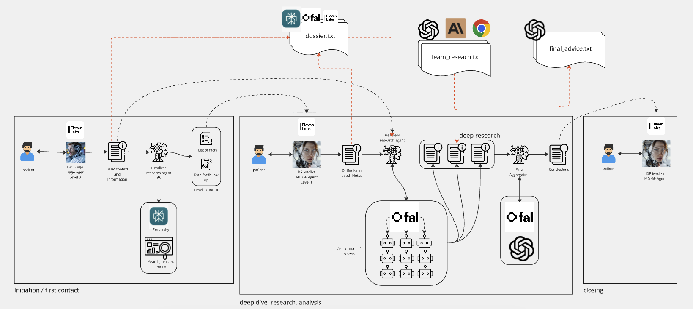

# ⚕️ MEDITRON: AI-Powered Medical Consultation System
For Feb.22.2025 ElevanLabs + a16z hackathon https://hackathon.elevenlabs.io/

<p align="center">
  <a href="https://www.youtube.com/watch?v=CmdD-cdgGdo">
    
  </a>
</p>
<p align="center">
  <a href="https://www.youtube.com/watch?v=CmdD-cdgGdo">Click to see the intro video</a>
</p>


## Overview

MEDITRON is a sophisticated, multi-stage AI system designed to assist in medical consultations.  It facilitates AI driven patient interaction, performs in-depth medical research, and provides a comprehensive assessment. The system leverages several cutting-edge AI models and APIs, including ElevenLabs (for conversational AI and text-to-speech), Perplexity AI (for initial research), and Fal.ai's Any-LLM (for a diverse range of medical perspectives).

<div align="center">
  
</div>

[Miro Board with architecture https://miro.com/app/board/uXjVIbQtG58=/?share_link_id=562796366164] 

The system operates in the following stages:

1.  **Triage (Dr. Triago):** An initial patient interaction using ElevenLabs' conversational AI to gather basic symptoms and medical history.
2.  **Initial Research:** Uses Perplexity AI to generate a preliminary report on potential causes and follow-up questions based on the triage conversation, leveraging web search.
3.  **Detailed Consultation (Dr. Medika):**  A second, more in-depth conversation with ElevenLabs' conversational AI, incorporating the initial research and the triage information.  Dr. Medika asks detailed follow-up questions to gather a comprehensive understanding of the patient's condition.
4.  **Expert Panel Research:**  Leverages Fal.ai's Any-LLM service to query multiple large language models (including GPT-4o, Claude 3.5 Sonnet, and Gemini Pro 1.5) from different medical perspectives (specialist, holistic, and risk assessment). Currently this generates 3x3 = 9 assesments from different perspectives and from different LLMs for maximal variability.
5.  **Final Assessment:**  Combines all gathered information and research results into a final, comprehensive assessment using GPT-4o.
6. **Audio Message Generation**: Generates a final audio message with the medical conclusion, to be played by the patient.

The entire process is documented in a "dossier" (`dossier.txt`), which is updated throughout the process, providing a complete record of the consultation.  The final assessment and individual model responses are also saved separately.

## Full run video [click for youtube]:

<p align="center">
  <a href="https://www.youtube.com/watch?v=3KRXogo3EK4">
    
  </a>
</p>

## Generated Assets

*   **dossier.txt:**  Progressive information gathered at the initial stages with the basic context, plus enriched with the web research and Dr Medika's 2nd interview insights.  
*   **team_research.txt:**  Deep research executed by a swarm of 9 instances combining 3 visions with 3 LLMs to achieve variety of perspectives. Very large document.   
*   **final_advice.txt:**  Consolidated final advice generated via reflection and summarization of the team research, and basis for the final communication to the patient. 


## Features

*   **Conversational AI Interaction:**  Simulates realistic doctor-patient conversations using ElevenLabs.
*   **Dynamic Research:**  Performs real-time medical research using Perplexity AI and Fal.ai's Any-LLM.
*   **Multi-Model Analysis:**  Gathers insights from a diverse range of AI models, providing a more comprehensive and balanced assessment.
*   **Dossier Creation:**  Maintains a detailed record of the entire consultation process, including conversation summaries, collected data, and research findings.
*   **Error Handling:** Includes robust error handling and fallback mechanisms to ensure the system operates reliably even with API issues.
*   **Final audio Message:** Creates a mp3 file with the conclusion and medical advice.
*   **Asynchronous Operations:**  Uses `asyncio` to handle multiple concurrent research tasks, improving performance.
*   **Clear Separation of Concerns:** The code is well-structured with separate modules for research (`research.py`), main logic (`main.py`), and the audio message generation, making it easy to understand, maintain, and extend.

## Scripts

*   **`main.py`:**  The main script that orchestrates the entire consultation process.  It manages the conversations with Dr. Triago and Dr. Medika, retrieves conversation data, generates research context, saves data to the dossier, performs expert research and assessment, and generates the final report.
*   **`research.py`:**  Handles the AI-powered research using Fal.ai's Any-LLM.  It queries multiple models with different perspectives, combines the results, and generates a final assessment.  It also includes an example usage section for running the research independently.
*   **`generate_final_audio.py`:** Reads the content of `final_advice.txt` file and using ElevenLabs and FAL's services, first prepares a natural language script to be spoken to the patient, and saves it as an mp3 file, using a defined voice.

## Setup and Installation

1.  **Clone the Repository:**

    ```bash
    git clone <repository_url>
    cd <repository_directory>
    ```

2.  **Install Dependencies:**

    ```bash
    pip install -r requirements.txt
    ```
    
3.  **Set up Environment Variables:**

    Create a `.env` file in the root directory of the project and add the following:

    ```
    ELEVENLABS_KEY=<your_elevenlabs_api_key>
    PERPLEXITY_KEY=<your_perplexity_api_key>
    FAL_KEY=<your_fal_ai_api_key>
    ```

    Replace `<your_elevenlabs_api_key>`, `<your_perplexity_api_key>`, and `<your_fal_ai_api_key>` with your actual API keys.

4.  **ElevenLabs Setup:**
    *   Obtain an API key from [ElevenLabs](https://elevenlabs.io/).
    *   You will need the Agent IDs (`TRIAGO_AGENT_ID` and `MEDIKA0_ID`) from your ElevenLabs Conversational AI setup.  These are used to identify the specific AI agents.

5.  **Perplexity AI Setup:**
    *   Obtain an API key from [Perplexity AI](https://perplexity.ai/).

6.  **Fal.ai Setup**
    * Obtain an API KEY from [Fal.ai](https://fal.ai)

## Usage

To run the entire consultation process, execute the `main.py` script:

```bash
python main.py
```

This will:

1.  Start a conversation with Dr. Triago.  Interact with Dr. Triago as you would with a real doctor, describing your symptoms.  You can end the conversation by saying "goodbye," "end call," or similar phrases.
2.  Wait for data processing.
3.  Retrieve the conversation data and generate research context.
4.  Start a conversation with Dr. Medika. Dr. Medika will use the information from the dossier (including the triage conversation and initial research) to ask further questions.
5.  Wait for further data processing.
6.  Retrieve the Medika conversation data.
7.  Perform expert research using multiple AI models.
8.  Generate a final assessment.
9. Save the final assessment and expert recommendations to the dossier.
10. Create an mp3 file with a message to the patient.

To run the research component (`research.py`) independently (e.g., for testing or re-running the research with a modified dossier):

```bash
python research.py
```

This will read the `dossier.txt` file, perform the research, and print the final medical advice. It will *also* save intermediate and final results to `team_research.txt` and `final_advice.txt`.  The audio message generation is independent, and can be run with:

```bash
python generate_final_audio.py
```

## Important Notes

*   **API Keys:** Ensure your API keys are correctly set in the `.env` file.
*   **Conversational AI:** The quality of the consultation depends heavily on the quality of your interactions with the ElevenLabs AI agents.  Be clear and concise in your responses.
*   **Error Handling:** While the code includes error handling, unexpected issues can occur with external API calls.  Monitor the output for any errors.
*   **Dossier:**  The `dossier.txt` file is overwritten at the beginning of each run.  If you want to keep previous dossiers, back them up before running the script.
*   **Cost:** Using these APIs (ElevenLabs, Perplexity AI, and Fal.ai) may incur costs. Be mindful of your usage.
* **Model Choice Justification:** The choices of GPT-4o, Claude 3.5 Sonnet, and Gemini Pro 1.5 reflect a balance between cost-effectiveness, performance, and availability on the Fal.ai platform. GPT-4o is used for the final assessment due to its strong reasoning capabilities.
* **Asynchronous vs. Synchronous:** While the Fal.ai calls *could* be made purely synchronous, using `asyncio.to_thread` allows for a smoother integration into the overall `asyncio` event loop, preventing blocking of the main thread. The main script itself is structured to be asynchronous.
*   **This system is for informational and research purposes only and should not be considered a substitute for professional medical advice.** Always consult with a qualified healthcare provider for any health concerns or before making any decisions related to your health or treatment.
*   **Eleven Labs Agents require configuration at the server** You can read the details at /agents_config folder

